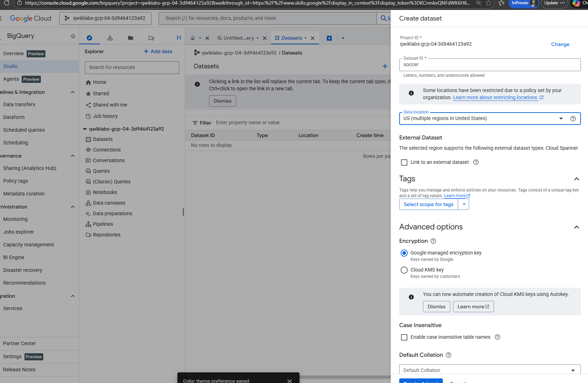
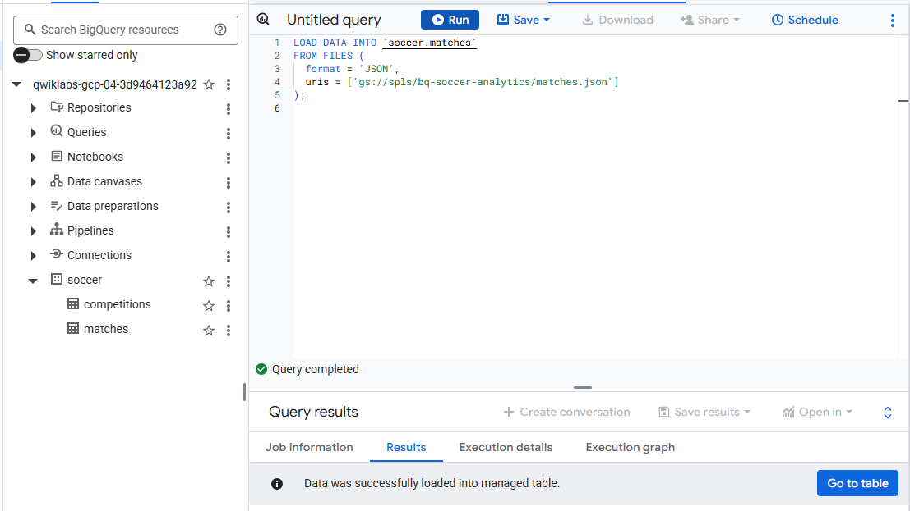
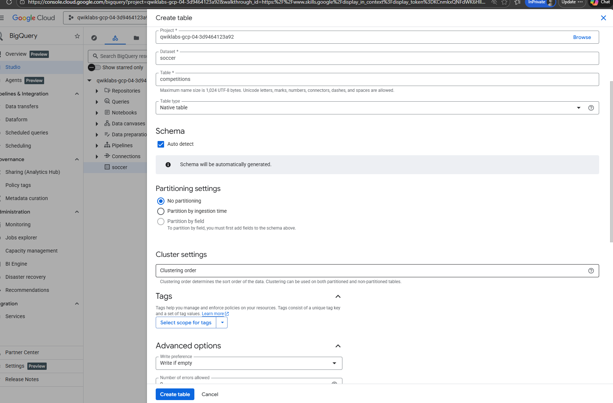
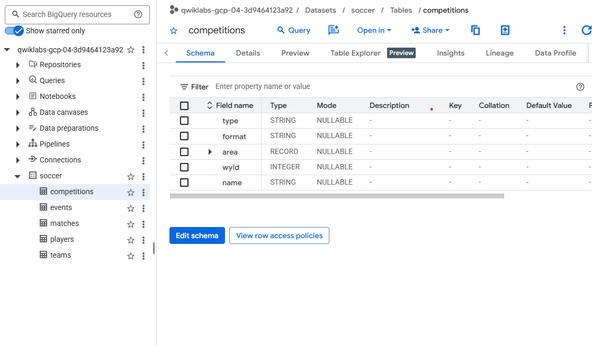
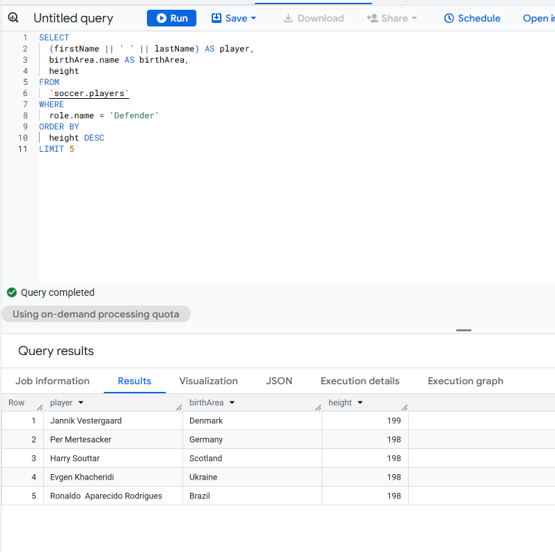
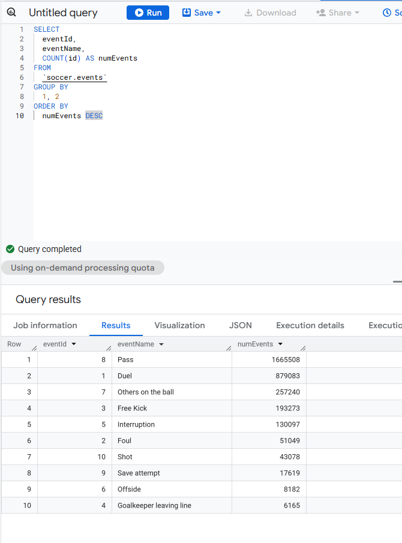

# Collect-process-store-gcs-data-BigQuerry
BigQuery Soccer Data Ingestion: Importing external sports data sources into BigQuery tables

# Objective : Upload files from Google Cloud Storage into BigQuery tables using the Cloud Console.
- Create database/dataset to store external data
- Ccreate custom Tables:  
  - Load data into the tables in the database
  - Methods:
    - LOAD JSON/CSV DATA - sql
    - Create Table console
    - Use Data Analytics Hub -From google cloud storage
- Query table
    -Check for:

1. Create database/dataset to store external data:
   - The dataset is used to add data to the project. Datasets utilize *tables and views* to help control access to data within a project.
   

2. Load data into the tables in the database :
   - LOAD JSON DATA - sql:
   
3. Create Table console:

   

5. Preview tables:
   

##Querrying:
###  1. Query player data:
##### Top 10 tallest defenders (for whom height is available) in the players table.

### 2. Query events data:
#### Total count of all the event types found in the event table

#### 3. Total domestic leagues in the competitions table

CITATION: This project is a part of gc data analytics certification program.
